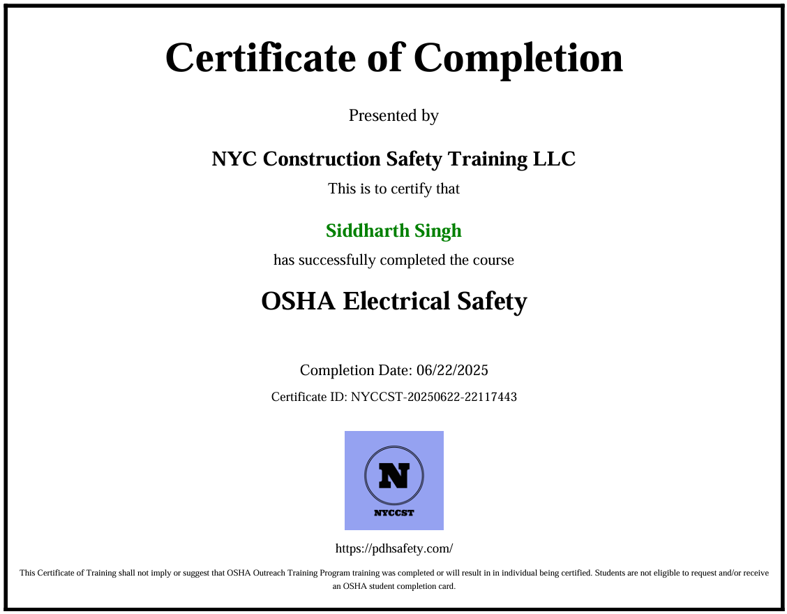

# ⚡ OSHA Electrical Safety Training – Summary

This repository documents my completion of OSHA-compliant electrical safety training, focused on PPE, shock and arc flash hazards, and workplace safety standards.

---

## ✅ Credential Details

- **Course Title:** OSHA Electrical Safety  
- **Platform:** PDHSafety.com  
- **Status:** Completed ✅  
- **Date Earned:** June 2025  
- 📄 [View Certificate (PDF)](certificate/OSHA-Electrical-Safety-Certificate.pdf)

---

## 🧠 Key Topics Covered

- Electrical PPE and hazard categorization  
- Earthing, shock hazards, arc flash risks  
- Overcurrent protection: MCB, ELCB, RCD  
- Emergency response and First Aid  
- OSHA standards and safety signs

---

## 🖼️ Certificate Preview

---

